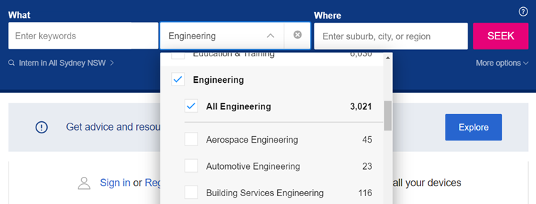
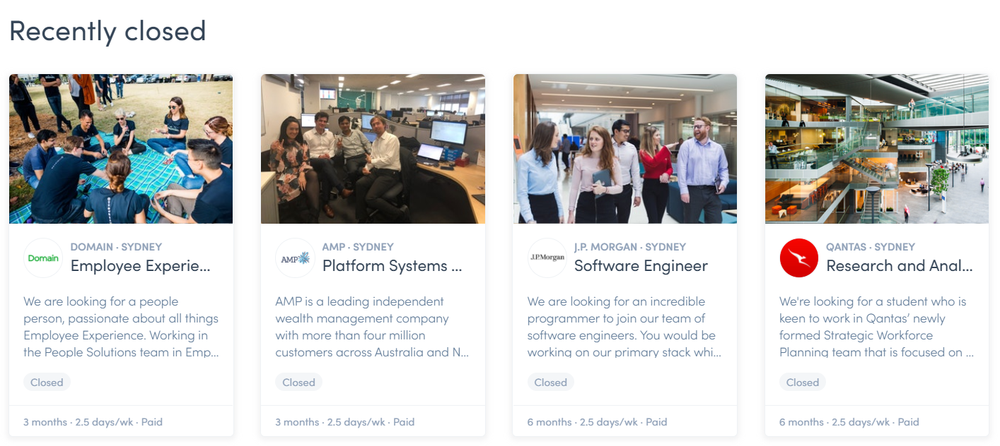
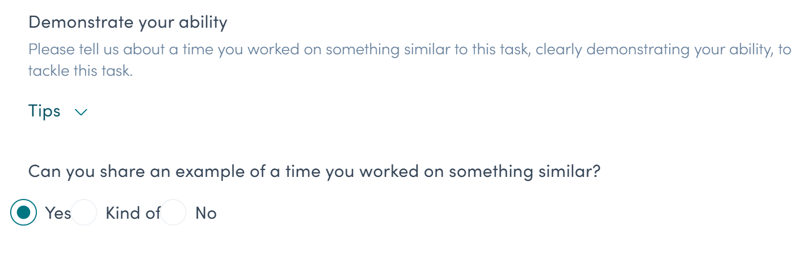
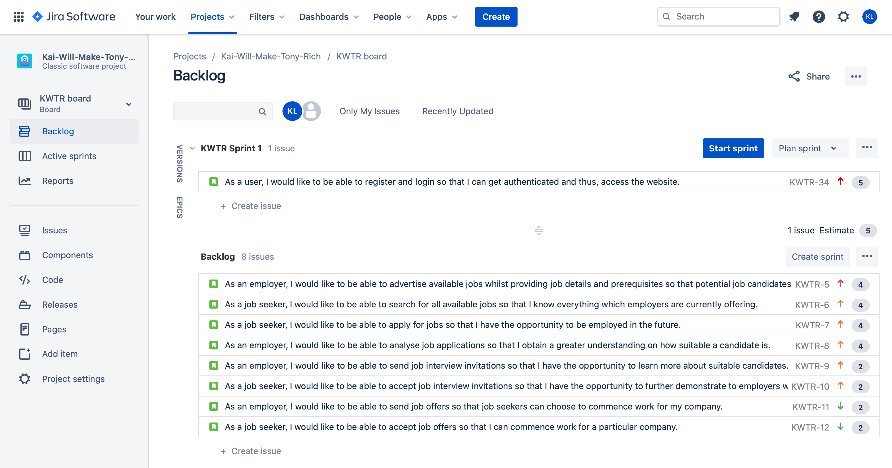
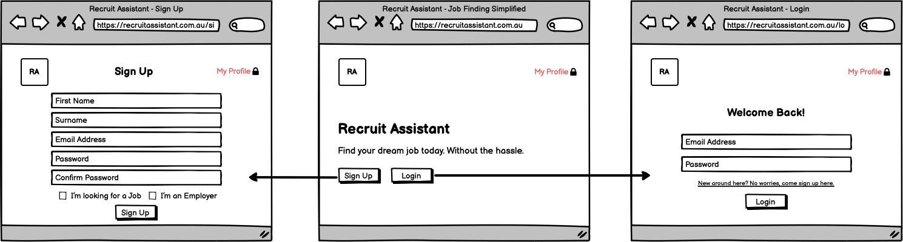
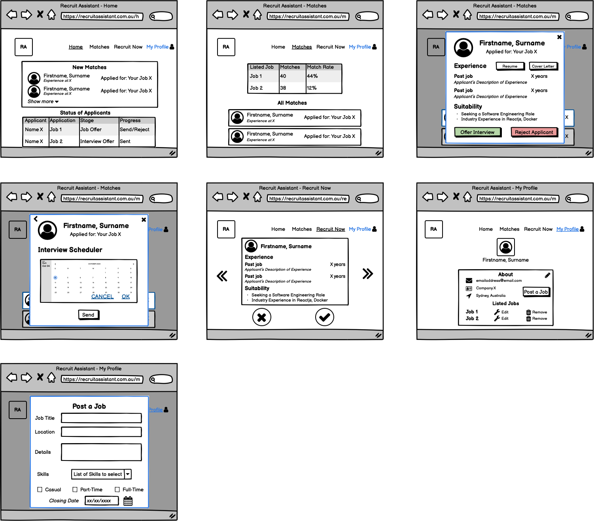
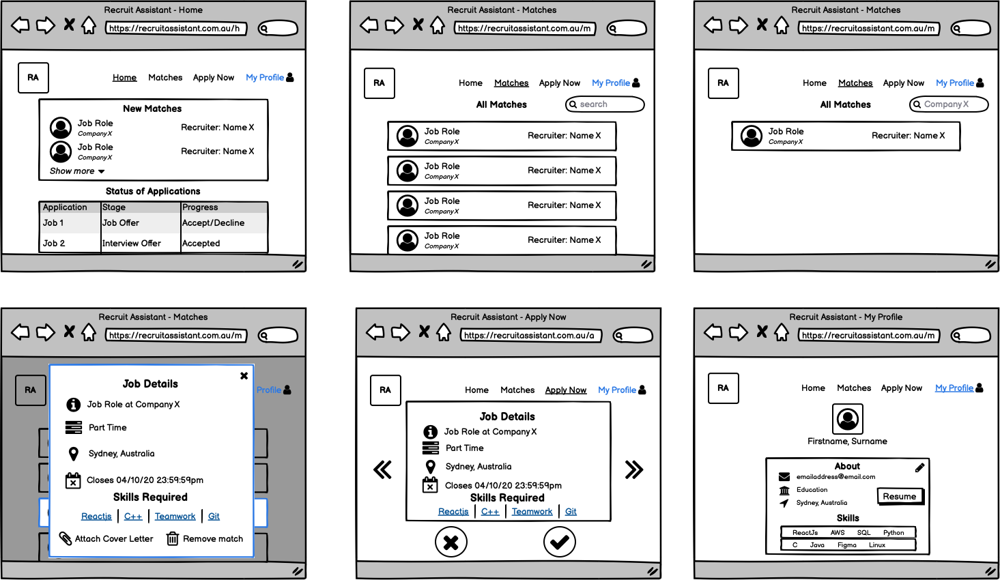
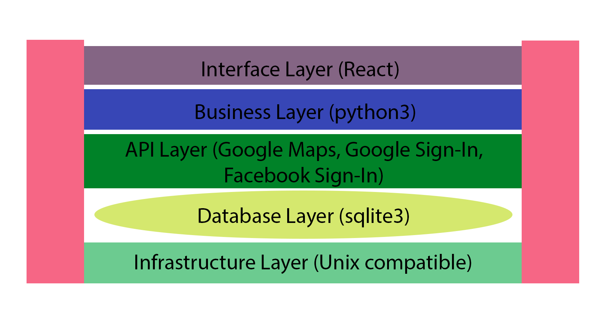

# Project Proposal

## Course: COMP3900 Capstone Project

## Project: Recruit Assistant

## Team: Kai-Will-Make-Tony-Rich

## Date Submitted: 4/10/2020

| Name          | Email                   | Student ID | Role               |
| ------------- | ----------------------- | ---------- | ------------------ |
| Kaiqi Liang   | kaiqi.liang@unsw.edu.au | z5210932   | Scrum Master       |
| William Huang | z5205986@unsw.edu.au    | z5205986   | Backend Developer  |
| Tony Lu       | z5204814@unsw.edu.au    | z5204814   | Backend Developer  |
| Richard Wang  | z5166088@unsw.edu.au    | z5166088   | Frontend Developer |

## Table of Contents
* Background
* User Stories
  - Backlog & Sprint 1
  - Subtasks
* Storyboard
* System
  - System Architecture
    - Interface Layer
    - API Layer
    - Business Layer
    - Database Layer
    - Infrastructure Layer
  - User Types
* Reference

## Background

Our problem domain is to develop a recruitment website for students that allows a job seeker to search for internships, graduate and student roles through various filters as well as indicate their qualifications and experience relating to each job role before applying. The website allows an employer to sort applications by qualifications and experience, shortlist or reject any applications, and send interview and offer letters.

Two existing websites/applications within the same problem domain were chosen for analysis: Seek and Hatch. For each one, an analysis of their strengths and weaknesses was conducted to shape the product our team is building.

Seek is a major Australian recruitment website which brands itself as an employment marketplace. The first point of contact is a search bar to enter keywords for job matches, next to a drop-down menu which includes various classifications for jobs such as “Accounting” and “Engineering”. Each checkbox contains sub-classifications where job seekers can specify the exact type e.g. “Aerospace Engineering” or “Chemical Engineering” under “Engineering”. For each ticked checkbox, there is a count for the number of available jobs in that classification and sub-classification. Finally, next to the classification menu, there is a location search bar to help applicants find jobs in a specified suburb, city or region. All of this is extremely easy to navigate and this is a massive advantage that our website will strongly consider in its build.

Despite the easy search interface, Seek does have the disadvantage of jobs potentially being mis-classified due to oversaturation of sub-classifications. A job may not cleanly fit into a single sub-classification and those which do not fit at all would be bundled into the “Other” sub-category, causing further confusion for applicants when searching this way. Since all jobs must be listed under a sub-category, employers might also struggle with accurately depicting the nature of the job with an ill-fitting option. Our website plans to mitigate this by streamlining the number of sub-categories or eliminating the need for it altogether.

Hatch is a recruitment website targeted at students interested in part-time/contracted student roles while they are still studying. Its strong positioning towards its target audience means it is a go-to website for this niche type of role, which might be much more difficult to find in a more generalist site such as Seek. There is no option for a search bar due to there not being many roles open at one time. Hatch’s user interface is more visual than Seek, having images to supplement the perception of a friendly work culture. Each individual job box contains information on the length of the role, the expected work days per week and a status to show whether the role is open or closed. This information is very relevant for Hatch’s student-driven purposes and hence is an advantage in this case.

For each job application in Hatch, there will be a number of tasks that each role requires. For each of those tasks, the applicant answers either “No”, “Kind of” and “Yes” to the question “Can you share an example of a time you worked on something similar?” If they answer any of the latter two, they must fill in a text box of up to 300 words where they describe previous experiences in fulfilling that task. Making applicants tick an option to past experiences for job tasks greatly helps employers sort and filter out inexperienced or unqualified applicants while reinforcing those which are qualified to do the job. This is an advantage which makes it easier for employers which our team will strongly consider in the construction of our recruitment website.

A glaring disadvantage in the website interface is the overflowing job description and (occasionally) title in each box, hardly making it past a single introductory sentence. An improvement to this would be a very short summary of the role in dot points, something that our team plans to implement in our recruitment website. Removing the picture in each box, which doesn’t serve any real functional purpose, would create extra space for text. There could also be a potential overload of jobs without the ability to search when the open roles span into the double digits, despite this not being a problem at the moment. Having a search bar to start with would mitigate this entirely.

An analysis of both Seek and Hatch proved fruitful in developing our team’s own website. However, Seek does not address the issue of both applicants and employers being bombarded with a large collection of applications at once and Hatch’s absence of a search bar limits its effectiveness to its current target audience of students looking for part-time roles. Our team proposes a solution to streamline this process: by only showing one result at a time and swiping left or right (or any equivalent implementation) to save a result ala Tinder, it forces both parties to address the current position and make a decision so that it can be saved for later or eliminated altogether, removing duplicate visits if not wanted. The process is kicked off with a search bar with filters to ensure that applicants can narrow down their set of “swiped” jobs, and employers can sort applicants by experience and qualifications.

## User Stories
### Backlog & Sprint 1

### Subtasks

- As a user, I would like to be able to register and login so that I can get authenticated and thus, access the website.

  - Members of the public are able to signup for an account (but without administrative privileges) through a form.
  - Employees are able to signup for an account (with administrative privileges) through a form.
  - All users are able to login successfully through a form and thus can access the website's functions.
  - All users are able to logoff successfully either by pressing a 'logoff button' or by closing the website.

- As an employer, I would like to be able to advertise available jobs whilst providing job details and prerequisites so that potential job candidates can apply for my jobs.

  - Advertised jobs contain a job description including responsibilities, employment type, location and application closing date.
  - Advertised jobs contain required qualifications and experience.
  - Employers can list additional documents and files which they desire from an employee’s job application such as a resume and cover letter.
  - Employers can finalise their advertisement by pressing a 'post advertisement' button.

- As a job seeker, I would like to be able to search for all available jobs so that I know everything which employers are currently offering.

  - Job seekers can browse for jobs through a searchbar.
  - Job seekers can search for specific jobs according to inputted criteria such as description, responsibilities, location, employment type and/or remuneration.
  - Job seekers can search by pressing the 'enter' key on their keyboard or pressing the 'find jobs' button.
  - **_Jobs are displayed to job seekers one at a time._**
  - Jobs can be saved if job seekers are interested in them.
  - If a particular job is not interesting to a job seeker, job seekers can view the next job by using the ‘right arrow’ key or by pressing the ‘next button’.
  - If a job seeker wants to visit a previous job, they can press the ‘left arrow key’ or by pressing the ‘previous button’.

- As a job seeker, I would like to be able to apply for jobs so that I have the opportunity to be employed in the future.

  - Job seekers are able to submit an application for their desired job by pressing a 'submit button'.
  - A job application must fulfil all the employer’s required inputs before submission is allowed.
  - Job seekers should provide evidence on why they think they are suitable for a particular job.
  - Job seekers are not able to apply for a particular job after its advertisement has closed.
  - Job seekers can attach additional documents through an 'upload button'.

- As an employer, I would like to be able to analyse job applications so that I obtain a greater understanding on how suitable a candidate is.

  - Employers are able to view the details of each job application.
  - Job applications should be arranged from most to least appropriate depending on how well they meet the employer’s requirements through a sorting algorithm.
  - **_Employers view jobs one at a time._**

- As an employer, I would like to be able to send job interview invitations so that I have the opportunity to learn more about suitable candidates.

  - After analysing all job applications, the most appropriate candidates receive interview invitations.
  - The number of interview invitations sent is determined by the employer through a form.
  - An employer can send job interview invitations through a 'send interview' button.

- As a job seeker, I would like to be able to accept job interview invitations so that I have the opportunity to further demonstrate to employers why I should be employed.

  - Job seekers can accept interview invitations if they are still interested in the job through an 'accept button'.
  - If job seekers are not interested anymore, they can also choose to decline the interview invitation through a 'decline button'.
  - Employers are able to see whether an interview invitation is accepted or declined.

- As an employer, I would like to be able to send job offers so that job seekers can choose to commence work for my company.

  - Employers send job offers to the most suitable candidate(s) after the interview stage though a 'send offer' button.
  - Job seekers must have received a job interview from an employer for that particular job first before they can receive a job offer.

- As a job seeker, I would like to be able to accept job offers so that I can commence work for a particular company.

  - Job seekers can accept job offers if they desire to start a particular job by pressing an 'accept button'.
  - If they do not desire to start a particular job, job seekers are also able to decline the job offer by pressing a 'decline button'.
  - Employers are able to see whether a job offer is accepted or declined.

## Storyboard

User Stories Covered:

- As a user, I would like to be able to register and login so that I can get authenticated and thus, access the website.

User Stories Covered:

- As an employer, I would like to be able to send job interview invitations so that I have the opportunity to learn more about suitable candidates.
- As an employer, I would like to be able to send job offers so that job seekers can choose to commence work for my company.
- As an employer, I would like to be able to analyse job applications so that I obtain a greater understanding on how suitable a candidate is.
- As an employer, I would like to be able to advertise available jobs whilst providing job details and prerequisites so that potential job candidates can apply for my jobs.

User Stories Covered:

- As a job seeker, I would like to be able to accept job interview invitations so that I have the opportunity to further demonstrate to employers why I should be employed.
- As a job seeker, I would like to be able to accept job offers so that I can commence work for a particular company.
- As a job seeker, I would like to be able to search for all available jobs so that I know everything which employers are currently offering.
- As a job seeker, I would like to be able to apply for jobs so that I have the opportunity to be employed in the future.

#### Note
The novelty of both job seekers and employers only being able to see jobs/job applications one at a time is that it ensures that both users must respond to whether they are interested or not in what they see. By doing this, users will not see the same thing twice, eliminating duplicate visits.

## System
### User Types
The main users of the application are divided into two types. Those who are looking for a job and those who wish to recruit personnel. Besides the sign up/log in pages, the user interfaces differ between these two user types. The difference in user interfaces are articulated in the 'Storyboard' section. However, the functionality is similar for both those who are looking for jobs and recruiting as they undergo the same process of filtering through candidates, following up on applications and updating their respective profiles. Some differences include that a job seeker have options to upload their resume and cover letters whilst employers must upload job vacancies which job seekers filter through.

### System Architecture

#### Interface Layer

UI/UX will be built on React.js along with CSS to style the frontend. Have not decided whether CSS frameworks like `Material UI` and `Booststrap` is needed, so for the time being vanilla CSS is what will be used.

#### API Layer

The APIs that will be used are Google Maps API for calculating the distance between users, Google and Facebook Sign-In API for allowing user to create an account with their existing Google or Facebook account.

#### Business Layer

The backend system will be developed in python3 using the Flask library to receive requests from the frontend. The sqlite3 library will also be used to connect to the database which will be discussed below.

#### Database Layer

Data will be managed in a relational database sqlite3 which does not require a server and data persistence is achieved by storing the data in a `.db` file on disk. This is managed internally by sqlite3.

#### Infrastructure Layer

This software is Unix (MacOS, Linux and any Unix like Operating System) compatible because sqlite3 is inbuilt to Unix. React is managed by npm and initialised using `npx create-react-app` which can all be run on a terminal. For Windows to work, WSL(Windows Subsystem for Linux) is required because it is Linux compatible.

## Reference
* SEEK. n.d. [online] Available at: <https://www.seek.com.au/> [Accessed 4 October 2020].

* Hatch. n.d. Hire Exceptional Talent | Hatch. [online] Available at: <https://www.hatch.team/explore> [Accessed 4 October 2020].