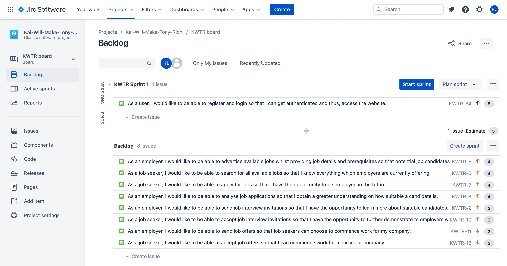

# Project Proposal
## Course: COMP3900 Capstone Project
## Project: Recruit Assistant
## Team: Kai-Will-Make-Tony-Rich
|Name|Email|Student ID|Role|
|----|-----|----------|----|
|Kaiqi Liang|kaiqi.liang@unsw.edu.au|z5210932|Scrum Master|
|William Huang|z5205986@unsw.edu.au|z5205986|Backend Developer|
|Tony Lu|z5204814@unsw.edu.au|z5204814|Backend Developer|
|Richard Wang|z5166088@unsw.edu.au|z5166088|Frontend Developer|

## Background
### Background Statement

### Purpose

## User Stories
### Backlog & Sprint 1

### Subtasks
|As a user, I would like to be able to register and login so that I can get authenticated and thus, access the website.|As an employer, I would like to be able to advertise available jobs whilst providing job details and prerequisites so that potential job candidates can apply for my jobs.|As a job seeker, I would like to be able to search for all available jobs so that I know everything which employers are currently offering.|As a job seeker, I would like to be able to apply for jobs so that I have the opportunity to be employed in the future.|As an employer, I would like to be able to analyse job applications so that I obtain a greater understanding on how suitable a candidate is.|As an employer, I would like to be able to send job interview invitations so that I have the opportunity to learn more about suitable candidates.|As a job seeker, I would like to be able to accept job interview invitations so that I have the opportunity to further demonstrate to employers why I should be employed.|As an employer, I would like to be able to send job offers so that job seekers can choose to commence work for my company.|As a job seeker, I would like to be able to accept job offers so that I can commence work for a particular company.|
|-|-|-|-|-|-|-|-|-|
|Members of the public are able to signup for an account (but without administrative privileges) through a form.|Advertised jobs contain a job description including responsibilities, employment type, location and application closing date.|
|Employees are able to signup for an account (with administrative privileges) through a form.|Advertised jobs contain required qualifications and experience.|
All users are able to login successfully through a form and thus can access the website's functions.|Employers can list additional documents and files which they desire from an employee’s job application such as a resume and cover letter.|
|All users are able to logoff successfully either by pressing a 'logoff button' or by closing the website.|
## System Architecture

### Interface Layer
UI/UX will be built on React.js along with CSS to style the frontend. Have not decided whether CSS frameworks like `Material UI` and `Booststrap` is needed, so for the time being vanilla CSS is what will be used.

### API Layer
The APIs that will be used are Google Maps API for calculating the distance between users, Google and Facebook Sign-In API for allowing user to create an account with their existing Google or Facebook account.

### Business Layer
The backend system will be developed in python3 using the Flask library to receive requests from the frontend. The sqlite3 library will also be used to connect to the database which will be discussed below.

### Database Layer
Data will be managed in a relational database sqlite3 which does not require a server and data persistence is achieved by storing the data in a `.db` file on disk. This is managed internally by sqlite3.

### Infrastructure Layer
This software is Unix (MacOS, Linux and any Unix like Operating System) compatible because sqlite3 is inbuilt to Unix. React is managed by npm and initialised using `npx create-react-app` which can all be run on a terminal. For Windows to work, WSL(Windows Subsystem for Linux) is required because it is Linux compatible.