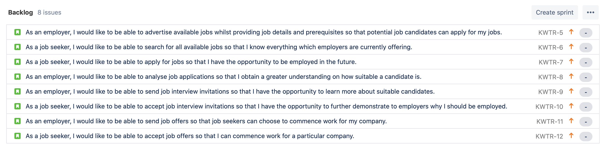
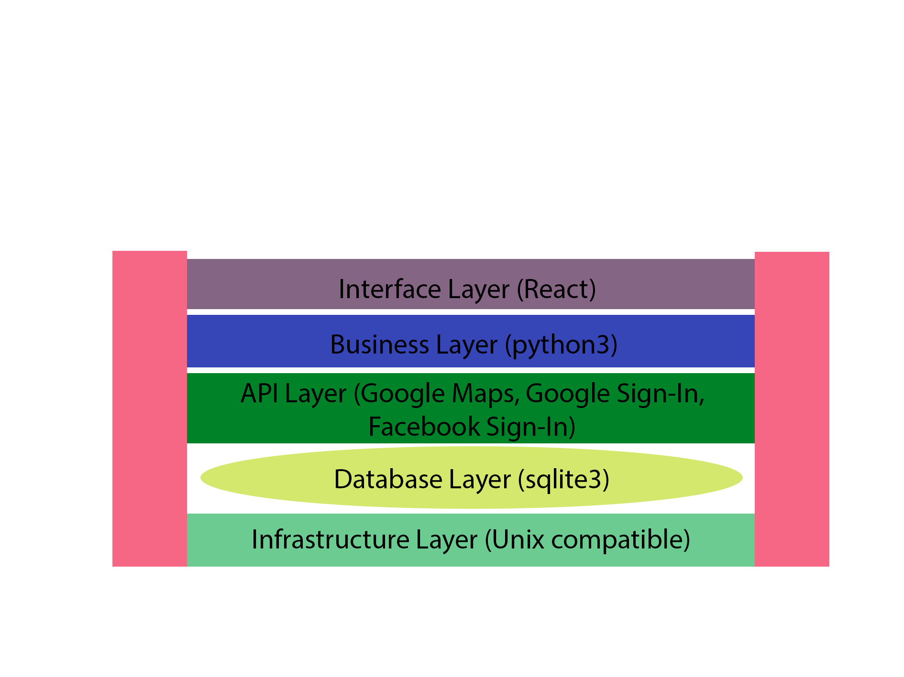

# Project Proposal
## Course: COMP3900 Capstone Project
## Project: Recruit Assistant
## Team: Kai-Will-Make-Tony-Rich
|Name|Email|Student ID|Role|
|----|-----|----------|----|
|Kaiqi Liang|kaiqi.liang@unsw.edu.au|z5210932|Scrum Master|
|William Huang|z5205986@unsw.edu.au|z5205986|Backend Developer|
|Tony Lu|z5204814@unsw.edu.au|z5204814|Backend Developer|
|Richard Wang|z5166088@unsw.edu.au|z5166088|Frontend Developer|

## Background
### Background Statement

### Purpose

## User Stories
### Backlog

## System Architecture

### Interface Layer
UI/UX will be built on React.js along with CSS to style the frontend. Have not decided whether CSS frameworks like `Material UI` and `Booststrap` is needed, so for the time being vanilla CSS is what will be used.

### API Layer
The APIs that will be used are Google Maps API for calculating the distance between users, Google and Facebook Sign-In API for allowing user to create an account with their existing Google or Facebook account.

### Business Layer
The backend system will be developed in python3 using the Flask library to receive requests from the frontend. The sqlite3 library will also be used to connect to the database which will be discussed below.

### Database Layer
Data will be managed in a relational database sqlite3 which does not require a server and data persistence is achieved by storing the data in a `.db` file on disk. This is managed internally by sqlite3.

### Infrastructure Layer
This software is Unix (MacOS, Linux and any Unix like Operating System) compatible because sqlite3 is inbuilt to Unix. React is managed by npm and initialised using `npx create-react-app` which can all be run on a terminal. For Windows to work, WSL(Windows Subsystem for Linux) is required because it is Linux compatible.